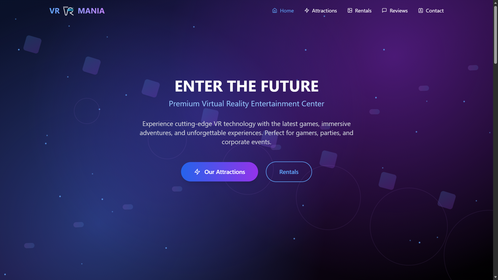
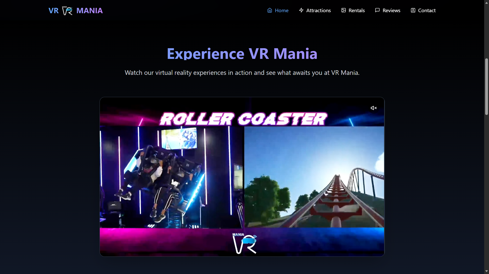
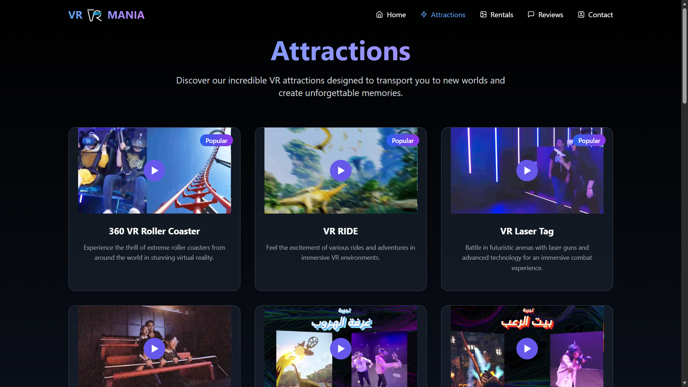
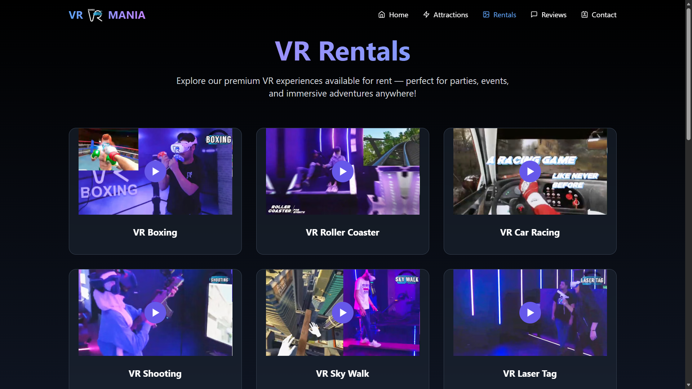
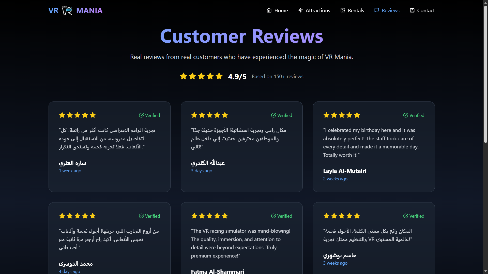
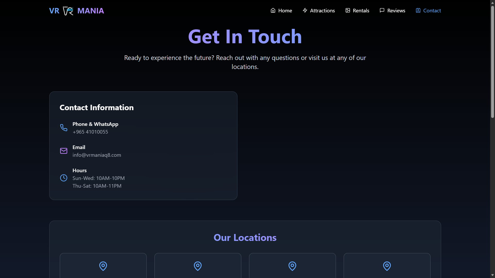
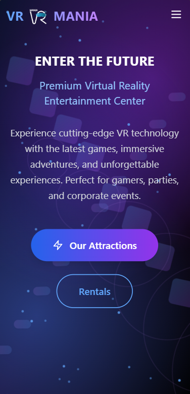

# 🎮 VR Mania Q8 Website



> A modern, responsive website developed for **VR Mania Q8** using React, TypeScript, Vite, and Tailwind CSS.

---

## 📖 Overview

This project is the official website for **VR Mania Q8**, designed to provide customers with an engaging experience while showcasing the company's VR attractions, rental services, testimonials, and contact information.

The website focuses on performance, responsiveness, and a clean user experience across desktop and mobile devices.

> **Note**
>
> The source code is proprietary and owned by the company. This repository is intended only to showcase the project through screenshots and technical documentation.

---

# 🚀 Technologies

| Technology | Purpose |
|------------|---------|
| React 18 | Frontend Framework |
| TypeScript | Static Typing |
| Vite | Development & Build Tool |
| Tailwind CSS | Styling |
| Lucide React | Icons |
| React Icons | Additional Icons |
| ESLint | Code Quality |
| PostCSS | CSS Processing |
| Autoprefixer | Browser Compatibility |

---

# 🏗 Project Architecture

```
VR MANIA Q8 WEBSITE
│
├── public/
│
├── src/
│   ├── components/
│   │   ├── Footer.tsx
│   │   ├── Navigation.tsx
│   │   └── VRFloatingElements.tsx
│   │
│   ├── data/
│   │   ├── attractions.ts
│   │   ├── features.ts
│   │   ├── rentals.ts
│   │   └── testimonials.ts
│   │
│   ├── pages/
│   │   ├── HomePage.tsx
│   │   ├── AttractionsPage.tsx
│   │   ├── RentalPage.tsx
│   │   ├── TestimonialsPage.tsx
│   │   └── ContactPage.tsx
│   │
│   ├── App.tsx
│   ├── main.tsx
│   └── index.css
│
├── package.json
└── README.md
```

---

# ✨ Features

- Responsive Design
- Component-Based Architecture
- Modern User Interface
- Smooth Navigation
- Interactive Sections
- Optimized Performance
- Mobile-Friendly Layout
- Scalable Project Structure

---

# 📱 Website Pages

- 🏠 Home
- 🎢 Attractions
- 🎮 Rentals
- ⭐ Testimonials
- 📞 Contact

---

# 📸 Screenshots

## Home Page



---

## Attractions



---

## Rentals



---

## Testimonials



---

## Contact



---

## Mobile Version



---

# ⚡ Performance

- Fast development using **Vite**
- Optimized production build
- Responsive across all devices
- Lightweight React components
- Modular and maintainable architecture

---

# 👨‍💻 My Contributions

As the Frontend Developer, I was responsible for:

- Designing and implementing the user interface
- Building reusable React components
- Developing responsive layouts
- Structuring application pages
- Integrating TypeScript
- Styling with Tailwind CSS
- Performance optimization
- Website deployment and production build

---

# 🔒 Source Code

The complete source code is **private** because it belongs to **VR Mania Q8**.

This repository is published solely to demonstrate the project's design, architecture, and development approach through screenshots.

---

# 🛠 Built With

- React
- TypeScript
- Vite
- Tailwind CSS
- Lucide React
- React Icons
- ESLint

---

## 📄 License

This repository is for portfolio purposes only.

All rights to the original source code and assets belong to **VR Mania Q8**.
